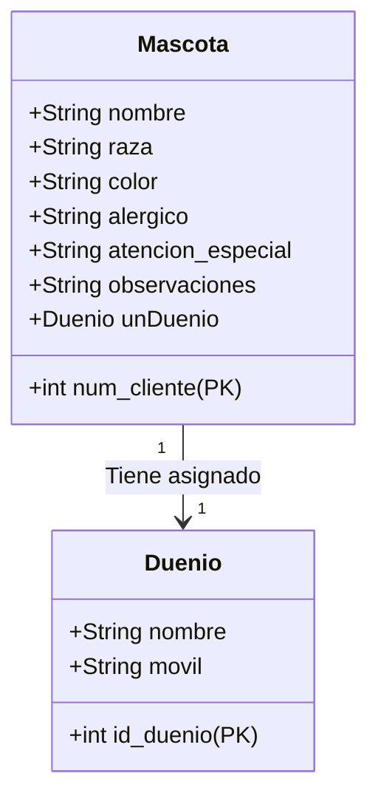

# 🐶 Peluquería Canina App

Aplicación de escritorio en Java para la gestión de clientes (mascotas y dueños) de una peluquería canina. Este proyecto implementa un registro completo de datos persistentes utilizando el patrón **Modelo de Capas**.

## 📋 Descripción del Caso

Una peluquería canina necesita digitalizar su sistema de gestión. La aplicación permite:

* Registrar datos de la **Mascota**: Nombre, raza, color, alergias, atención especial, observaciones.
* Registrar datos del **Dueño**: Nombre, celular, dirección.
* Almacenar toda la información en una base de datos.
* Interfaz gráfica de usuario (GUI) amigable.

## 🚀 Tecnologías Utilizadas

* **Java 17**: Lenguaje principal.
* **Java Swing**: Para la interfaz gráfica de usuario (IGU).
* **JPA / Hibernate**: Framework de persistencia (ORM).
* **MySQL**: Base de datos relacional.
* **Maven**: Gestión de dependencias y construcción.

## 🏗️ Arquitectura

El proyecto sigue una arquitectura en capas ("Modelo de Capas") para separar responsabilidades:

* **`igu`**: Capa de presentación (Ventanas, Formularios, Botones).
* **`logica`**: Clases del dominio (`Mascota`, `Dueño`) y lógica de control.
* **`persistencia`**: Controladoras de persistencia y conexión a la BD.

## 🗄️ Esquema de Base de Datos

El sistema maneja dos entidades principales con una relación **1 a 1** (Una mascota tiene un dueño asociado).



## ⚙️ Configuración y Ejecución

1. **Base de Datos**:
    * Asegúrate de tener MySQL corriendo.
    * La aplicación creará las tablas automáticamente gracias a Hibernate (`hibernate.hbm2ddl.auto`).

2. **Clonar y Construir**:

    ```bash
    git clone <URL_DEL_REPOSITORIO>
    cd PeluqueriaCanina_Java
    ./mvnw clean install
    ```

3. **Ejecutar**:
    Ejecuta la clase principal `App.java` o `PeluqueriaCanina.java` desde tu IDE favorito (IntelliJ, Eclipse, NetBeans) o mediante línea de comandos.

---
